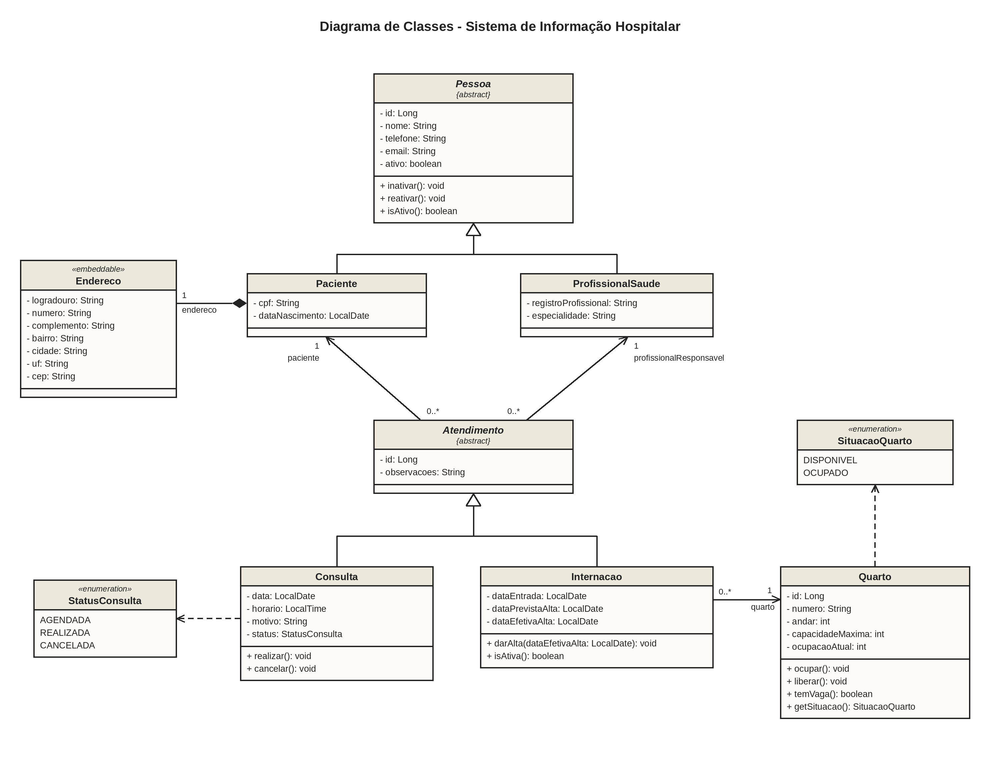

# Sistema de Informação Hospitalar

Sistema web para gestão hospitalar: pacientes, profissionais de saúde, consultas, internações,
quartos e histórico médico. O back-end é uma API REST e o front-end é composto por páginas
estáticas servidas pela própria aplicação. Trabalho prático da disciplina de Programação
Modular (PUC Minas).

## Sprint 1

Entregas da Sprint 1: protótipo navegável do front-end (telas sem funcionalidade), diagrama de
classes e cartões CRC.

### Telas do protótipo

As telas ficam em `src/main/resources/static/`. Os formulários e botões de ação ainda não
enviam dados; ao usá-los, o protótipo mostra um aviso.

| Tela | Arquivo | Conteúdo |
|------|---------|----------|
| Painel | `index.html` | Resumo do dia, próximas consultas e atalhos |
| Pacientes | `pacientes.html` | Listagem e cadastro de pacientes |
| Profissionais | `profissionais.html` | Listagem e cadastro de profissionais de saúde |
| Consultas | `consultas.html` | Agenda por profissional e data, agendamento de consultas |
| Internações | `internacoes.html` | Internações em andamento, nova internação e registro de alta |
| Quartos | `quartos.html` | Ocupação, situação e cadastro de quartos |
| Histórico médico | `historico.html` | Consultas e internações de um paciente em ordem cronológica |

Com a aplicação rodando, o protótipo abre em `http://localhost:8080`. Também é possível abrir
os arquivos HTML diretamente no navegador, sem subir a aplicação.

### Documentação de modelagem

- [Diagrama de classes](docs/diagrama-de-classes.png)
- [Cartões CRC](docs/cartoes-crc.pdf)



## Stack

- HTML, CSS e JavaScript no front-end, sem frameworks
- Java 21 e Spring Boot 4 (Web MVC, Data JPA, Validation)
- PostgreSQL 17 instalado localmente
- Flyway para migrations (schema validado pelo Hibernate com `ddl-auto=validate`)
- springdoc-openapi (Swagger UI)
- JUnit 5, Mockito, AssertJ, H2 (modo PostgreSQL) e JaCoCo
- Maven Wrapper

## Pré-requisitos

- Java 21 (JDK Temurin recomendado)
- PostgreSQL 17 (instalador oficial para Windows)

Não é necessário instalar o Maven: o projeto usa o Maven Wrapper (`mvnw.cmd`).

## Criando o banco de dados

Com o PostgreSQL em execução, crie o banco `hospital` (no PowerShell):

```powershell
& "C:\Program Files\PostgreSQL\17\bin\psql.exe" -h localhost -U postgres -c "CREATE DATABASE hospital"
```

As tabelas são criadas automaticamente pelo Flyway na primeira execução da aplicação.

## Configuração da conexão

A conexão é lida de variáveis de ambiente, com valores padrão para o ambiente local:

| Variável      | Padrão                                     |
|---------------|--------------------------------------------|
| `DB_URL`      | `jdbc:postgresql://localhost:5432/hospital` |
| `DB_USER`     | `postgres`                                 |
| `DB_PASSWORD` | `hospital123`                              |

Para usar outros valores, defina as variáveis antes de iniciar a aplicação:

```powershell
$env:DB_PASSWORD = "minha-senha"
```

## Como rodar no Windows (PowerShell)

```powershell
.\mvnw.cmd spring-boot:run
```

A aplicação sobe em `http://localhost:8080`.

## Documentação da API

- Swagger UI: http://localhost:8080/swagger-ui.html
- OpenAPI (JSON): http://localhost:8080/v3/api-docs

## Testes e cobertura

Os testes usam o perfil `test`, com banco H2 em memória no modo PostgreSQL. Não é preciso
ter o PostgreSQL rodando para executá-los.

```powershell
.\mvnw.cmd verify
```

O relatório de cobertura do JaCoCo é gerado em `target/site/jacoco/index.html`.
